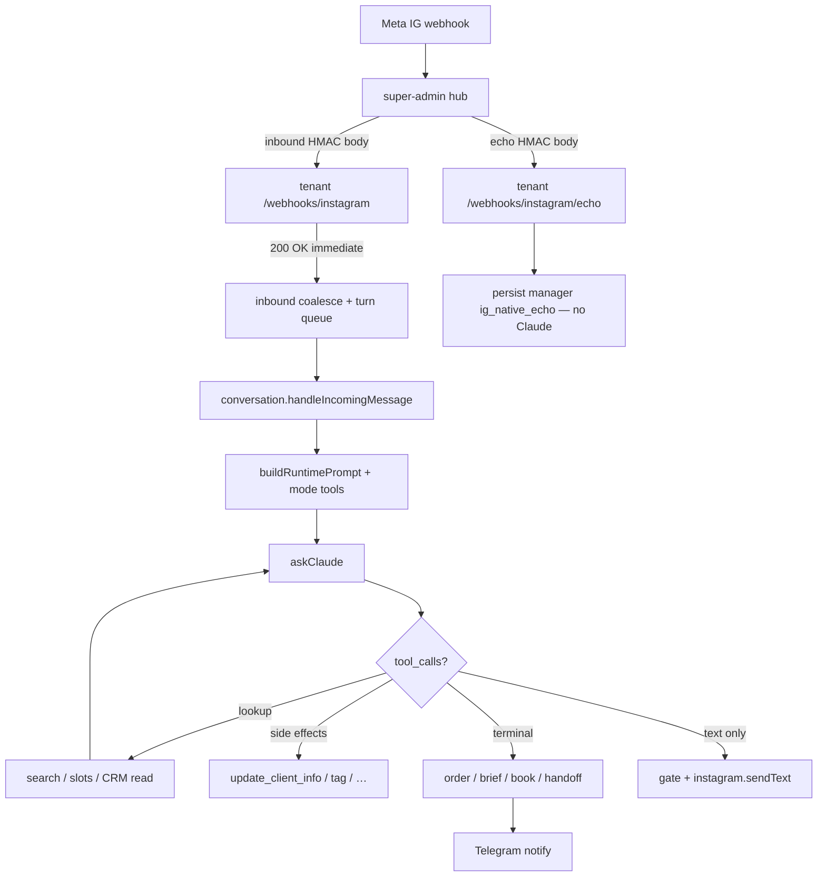

# Agent runtime — what lives inside the system

Canonical map of the Instagram DM AI agent for this platform: spawn model, prompt layers, tools, CRM, admin assistants, and performance constraints.

**Source of truth in code** (keep in sync when changing tools/CRM/modes):

| Concern | Path |
|---------|------|
| Modes + tool schemas | `apps/backend/src/lib/tool-definitions.ts` |
| Tool instructions in prompt | `apps/backend/src/lib/agent-tools-prompt.ts` |
| Platform map (modes/CRM/tools) | `apps/backend/src/lib/platform-capabilities-prompt.ts` |
| Claude CLI spawn | `apps/backend/src/services/claude.ts` |
| Customer turn orchestration | `apps/backend/src/services/conversation.ts` |
| Runtime prompt composition | `apps/backend/src/services/prompt-builder.ts`, `prompt-runtime.ts` |
| Multi-CRM routing | `apps/backend/src/lib/crm-routing.ts`, `docs/MULTI_CRM_INTEGRATION_GUIDE.md` |
| Tenant seed knowledge | `apps/workspace/templates/` |

Claude invocation = **headless Claude Code CLI / Agent SDK** (`query()` default, `claude -p` hotfix), **not** the Anthropic Messages API.

---

## End-to-end customer turn

Inbound: `routes/webhooks.ts` → `lib/inbound-coalesce.ts` → `lib/conversation-turn-queue.ts` → `services/conversation.ts`.

**Native Instagram manager replies (`is_echo`):** not treated as client inbound. The hub matches the business `sender.id` + `entry.id` (never the client IGSID in `recipient`) and POSTs the **same raw HMAC body** to tenant `POST /webhooks/instagram/echo`. Inbound still skips `is_echo`. The echo path persists `sender=manager` with `igContext.kind=ig_native_echo` so admin shows **Менеджер · Instagram** (chip «З Instagram»). Own Graph sends are de-duplicated via `message_id` (plus a short text heuristic). No Claude, no coalesce, no new conversation, no Telegram handoff card. If the open thread was `bot`, it becomes `handoff` («Менеджер відповів з Instagram»); `paused` stays paused.

Instagram clients often split one answer across several bubbles (`10:00` then name then phone). Coalesce waits for silence (longer when the last bubble looks like a fragment), joins them as one user turn, and absorbs late mids that arrive during `responseDelay` / Claude. Do not re-ask for data already in those bubbles.

Instagram **post shares** in DM arrive as `ig_post` (and legacy `share`, deprecated after Feb 2026). The webhook stores caption + permalink + preview image, downloads the lookaside CDN before it expires, and injects the photo into Claude vision plus `search_catalog`. Admin chat shows a post card (image + caption + link), not an unsupported “?” placeholder.

Instagram may also emit a **second empty bubble** when it auto-parses a phone number (`fallback` / `unsupported` / `tel:`). The webhook stores that as visible `📞 +380…` text (and a `detected_phone` context), so admin is not blank and heuristics/agent see the number. A duplicate chip coalesced with the typed bubble is dropped from the Claude user turn.

**First contact:** if this Instagram user has never had an inbound row in our DB, the webhook pulls the last **20** Graph conversation messages (`GET /{page-id}/conversations?platform=instagram&user_id=` → `/{thread}/messages`) *before* the first Claude turn. Imported inbound is marked `claudeTurnId=skipped` so drain does not replay history as new turns. Graph typically cannot return more than ~20 message bodies. Failures/timeouts are non-fatal. Imported salon replies are `sender=manager`, not `bot`. Session prompt: **first bot outbound** still introduces per the tenant system prompt in the same reply as the answer; later turns must not re-greet **in the same UUID**. After `sessionFreshnessDays` (default 14) of silence the webhook **closes** the bot or handoff thread and opens a new conversation so the agent greets again. Claude history is the tenant **civil day** of this UUID (or after the last completed order/visit today). Turns are stamped with tenant-local date/time and sender (`менеджер` vs `бот`).

**Handoff Telegram:** `request_handoff` sends one escalation card to manager **groups**. Agent-turn / vision debug (`🛠 Хід агента`) goes only to a **private chat with the bot** (admins after `/login`) — never to groups the bot was added to. Cards use the client name or `@username`, not IGSID. After the first card, at most **one** short follow-up when the client writes again. Further inbound stays in admin only. Idle TTL (`handoff_return_to_bot_minutes`, default 60) returns the thread to the bot on the **next inbound** *in the same UUID*; it does **not** close orders. A manager reply resets the idle timer. Silence longer than `sessionFreshnessDays` instead **closes** the handoff thread and starts a new conversation (orders stay on the client).

IG `typing_on` is owned by the coalesce wait (bootstrap) and then by `conversation.ts`. After a flush, re-arm (and keep typing) only if unclaimed inbound remains; empty drains must send `typing_off` so Meta keepalive cannot run forever.

---

## Claude runtime

Customer path goes through `askClaude` → `ClaudeRuntime` (`lib/claude-runtime.ts`). Default is Agent SDK `query()` (`CLAUDE_RUNTIME=sdk`) with coding tools locked down. `CLAUDE_RUNTIME=cli` is a **hotfix rollback** (`claude -p`). Vision turns on the SDK path use an explicit logged CLI fallback (`cli_vision_fallback`). Auth / usage / login stay on `~/.local/bin/claude`. See [`CLAUDE_AGENT_SDK_MIGRATION_PLAN.md`](../CLAUDE_AGENT_SDK_MIGRATION_PLAN.md).

| Piece | Behavior |
|-------|----------|
| Runtime flag | `CLAUDE_RUNTIME=sdk\|cli` (default **`sdk`**; `cli` = hotfix) |
| Customer transport | **sdk:** `@anthropic-ai/claude-agent-sdk` `query()` (lockdown + in-process MCP). **cli hotfix:** `claude -p` JSONL + text `<tool_call>` |
| Binary | `~/.local/bin/claude` (`lib/claude-binary.ts`) — auth/usage always this CLI, even when customer path is `sdk` |
| Args | `-p --output-format stream-json --verbose --model {haiku\|sonnet\|opus}` (CLI path) |
| CWD | `~/.cache/platform-ai-agent/{instance}/claude-spawn` — **isolated** from `~/tenant_knowledge` (avoids parent `CLAUDE.md` pollution) |
| Tools | **SDK (default):** in-process MCP `mcp__platform__*`; lookup handlers run in-process; terminal/`canUseTool` gate, host executes book/collect/handoff in `conversation.ts`. **CLI hotfix:** text `<tool_call>` |
| Concurrency | `CLAUDE_MAX_CONCURRENCY` (default 2) shared IG/sandbox/insights; meta-agent: `CLAUDE_META_MAX_CONCURRENCY` (default 1) — teach does not queue behind IG |
| Warmup | `CLAUDE_WARMUP_ON_START` → `runtime.warmup()` (SDK uses `query()`, not ad-hoc `claude -p`). Bypasses semaphores. Must **not** open the quota circuit |
| Abort | CLI: process-group `SIGKILL` (`detached`) + warn if pid alive after 2s. SDK: `interrupt()` + `query.close()`. Sandbox disconnect / mid-turn prompt activate abort the turn `AbortSignal` |
| Health | Orphan `claude` (ppid 1) → warn only, do not fail the check |
| Session reuse | **One session per turn** (`lib/turn-claude-sessions.ts`): tenant reply model (`sonnet\|opus`) `--resume` across tool rounds. Mid-turn prompt activate clears the resume id **and** aborts in-flight Claude. Lookup rounds reuse `resume`, not a long-lived `ClaudeSDKClient`. SDK has **no `maxTurns` cap** (stop is query timeout). If Claude Code still emits `error_max_turns`, text/tools are kept — not a customer timeout |
| Reply model | Tenant picks **sonnet \| opus**. The same model runs the first spawn and every tool follow-up (no Haiku router). Haiku is not in the admin picker; it is only used for warmup / usage probes. |
| Channels | `instagram`, customer telegram, `meta_agent`, `sandbox`, `supervisor`, `insights` |

---

## Prompt composition (customer agent)

Order in `buildRuntimePrompt` / `askClaude`:

1. Anti-injection preamble  
2. Active system prompt from DB (`system_prompts`, `isActive`) with placeholders (hours, branches, brand)  
3. Session block: time **in tenant timezone** (`agent_config.timezone`, default `Europe/Kyiv` — not the host OS, often DE), client profile, CRM **link hint** (full visits via `get_client_crm_history`), branches, Telegram bots, out-of-hours, previous brief  
4. Live catalog snippet: sales/leadgen → products+services+masters (~12k); **booking** → masters only (≤1k); services/prices via tools  
5. Mode tools block (`formatAgentToolsPrompt`)

| Layer | Injected at runtime? |
|-------|----------------------|
| DB system prompt | Yes |
| Seed `prompts/{sales,leadgen,booking,general}-agent.txt` | First DB seed uses **general** (matches default `agent_config.mode`) |
| Live catalog / services / masters files | Yes (mode-aware snippet; products from CRM sync **or** manual CSV import per `catalog_import.sourcePriority`) |
| Full CRM visit history | **No** on cold prompt — tool `get_client_crm_history` |
| Legacy `knowledge/contacts|faq|…` | **No** |
| Tenant disk `CLAUDE.md` | **No** (spawn cwd isolated) |
| `<platform_capabilities>` | Meta-agent + **AI-помічник (insights)** — not the customer IG agent |

---

## Agent modes and tools

Shared: `update_client_info`, `tag_client`, `request_handoff`, `create_local_order`; optional `set_conversation_branch`.

| Mode | Purpose | Mode-specific tools | Terminal outcome |
|------|---------|---------------------|------------------|
| **sales** | E-commerce | `search_catalog`, `get_delivery_cost`, `collect_order` | Local order (+ optional CRM mirror) |

**Product order amounts:** `items[].price` = catalog/list price from search/file; `quoted_total` (required on `collect_order` / Insights `create_product_order`) = amount told to the customer. KeyCRM mirror scales line prices to `quotedTotal`; Telegram and admin show quoted (+ catalog when they differ). Legacy rows without `quotedTotal` fall back to catalog sum on read.
| **leadgen** | Qualification / brief | `classify_intent`, `submit_brief` | Brief + Telegram (+ optional KeyCRM lead) |
| **booking** | Salon appointment | `search_services`, `get_available_slots`, `get_client_crm_history`, `attach_reference_photo`, `book_appointment`, `cancel_appointment`, `remove_appointment_service`, `reschedule_appointment` | CRM appointment |
| **general** | All scenarios (**default**) | Union of sales + leadgen + booking (deduped) | Same handlers; pick tool by client intent |

**general** is not a separate tool list: `buildAgentTools('general')` merges the specialized builders. When you add a tool to sales/leadgen/booking, it appears in general automatically (enforced by unit test).

**Cancel / reschedule:** `cancel_appointment` (full visit), `remove_appointment_service` (one line; last line → full cancel), `reschedule_appointment` (cancel old + book new). Do **not** use a second `book_appointment` as a move (SDK denies when an active visit exists on another date/time). **Refund / payment cancel** → still `request_handoff`. BeautyPro supports `PUT` cancel and `services[].action=delete`.

`book_appointment` schema still needs name + phone + date + time + services, but the agent must **not** pass empty placeholders: show slots without contacts if needed; if a required field is missing from the chat and from the known-profile block, ask for it; if the profile already has phone/name, reuse them. Extra tenant fields (birthday, etc.) are not a platform booking gate.

Parallel services at the same clock time need **per-line** `services[].master_id` (different professionals). Slot tool labels `MODE: PARALLEL` vs `MODE: SEQUENTIAL`. A single top-level `master_id` is copied only onto lines that omit their own id; same master → sequential starts in BeautyPro. Preferred master from history applies **only to a similar service**; same display names are disambiguated with positions / short id in slot labels. `book_appointment` refuses `MASTER_SERVICE_MISMATCH` when CRM grades mark the master unavailable for that service. Old failed bookings: admin sets masters per Appointment service line, then retry CRM (`PATCH /orders/:id/booking-services` → `POST /orders/:id/sync-crm`).

**Telegram to managers is not a tool** — it fires as a side effect of handoff / order / brief / booking / cancel / reschedule / agent failure (`services/telegram-notify.ts`). Operational cards go to groups + linked DMs; `🛠 Хід агента` / vision debug only to private bot chats. Product order cards are **notify-only** (no approve/decline — the agent already confirmed the client).

---

## Multi-CRM

All CRM I/O goes through `getCrmAdapter` + `resolveCrmProvider(action)`. Never call CRM HTTP from `conversation.ts`.

| Provider | Typical actions |
|----------|-----------------|
| KeyCRM | catalog, orders, leads, client upsert |
| CleverBOX | services, branches, booking |
| BeautyPro | services, branches, booking, client upsert, visit history |

Routing modes: `single` | `by_action` | `prompt`. Hybrid example: catalog/order → KeyCRM, services/booking → BeautyPro.

Client link: `Client.crmBuyerId` (+ `crmProvider`, `crmLinkedAt`). Details: `docs/MULTI_CRM_INTEGRATION_GUIDE.md`, BeautyPro: `docs/BEAUTYPRO_CRM_INTEGRATION.md`.

---

## Admin assistants (three different agents)

| UI (nav) | Route | Channel | Role |
|----------|-------|---------|------|
| **AI-помічник** | `/insights` | `insights` | Ops assistant: metrics snapshot + **host tools** (get/search conversation, client R/W, propose→confirm product order + CRM mirror, CRM write status / retry). Owner-only. Writes require `confirm: true` after explicit owner confirmation; **never** sends IG to the customer. |
| **Навчання агента** | `/teach` | `meta_agent` | Edits system prompt via diffs; gets `<platform_capabilities>`. |
| **Тестування агента** | `/sandbox` | `sandbox` | Simulates customer chat with real tools/prompt. |

Insights context: fresh `buildInsightsSnapshot(period)` + `buildPlatformCapabilitiesBlock()` + `buildInsightsToolDefinitions()` / `executeInsightsToolCall` in `routes/insights.ts` (`services/insights-tools.ts`, `services/order-admin.ts`). Snapshot samples are truncated — load a dialog via `get_conversation` when the owner pastes `/conversations/{uuid}`.

**Conversation Detail (tenant manager):** buttons send payment requisites (`agent_config.paymentRequisites`), force a logical Claude reply, or complete an order (even in handoff). Payment screenshots get a human-confirm note on the order. Retry internals are admin system notes only — never Instagram.

Vision: IG screenshots are downscaled (long edge 1568px); PDF files attach as Claude `document` blocks. Customer vision turns use `CLAUDE_VISION_TIMEOUT_MS` (default 180s) so a 60s CLI timeout does not skip reading a receipt.

---

## What the customer agent can “see”

- Active business prompt (tone, FAQ, rules, offer framing)  
- Client profile fields collected so far + tags + branch  
- Recent conversation: tenant civil day of this UUID (or from conversation start if it began today); if a completed order/visit already happened today, from **after** that marker. Soft cap ~80 after dropping system/empty rows — not a hard last-30 cut.  
- Last `get_available_slots` offer (`Conversation.bookingOffer`, ~2h TTL) injected as «Запропоновані вікна» so a pause for name/phone does not invent new hours
- Catalog / services / masters live snippets + search tools (`search_catalog` merges file↔CRM matches when present; quotes `pricePreference` price and notes material CRM/file deltas)  
- CRM link hint when linked (booking); full visits via `get_client_crm_history`  
- Working hours / out-of-hours strategy  
- Mode tool surface only (no inventing tools)

**Must not** expose to the Instagram client: product/offer/CRM UUIDs, internal ids, other conversations’ data.

---

## Performance constraints (current)

| Factor | Impact |
|--------|--------|
| Fresh CLI spawn on **first** round of a turn | Cold start cost (Opus/Sonnet) |
| Tool follow-ups | Same reply model `--resume` (one session per turn) |
| Slot / search tool results | Display cap **3** slot times/day (previously offered times stay if still free); service search default limit **8** |
| Semaphore max 2 | Queue / busy fallback under load |
| Large system prompt + catalog + history on cold start | Token and TTFT cost (booking omits services-live dump) |
| Intentional `responseDelay` | Product latency (0–60s), not a bug |
| Insights snapshot | In-memory TTL (~45s) per period — chat turns reuse one snapshot |
| Turn debug | Spawn counters (cold vs resume) in admin agent-turn notes |

Optimization directions (roadmap): parallelize independent tool lookups where safe; compact tool schemas; history char budget.

**Claude Agent SDK migration** (planned, not started): control layer over the same CLI subprocess — typed sessions/events, in-process MCP tools, no Messages API swap and no billing change in that track. Phases + checklists: [`CLAUDE_AGENT_SDK_MIGRATION_PLAN.md`](../CLAUDE_AGENT_SDK_MIGRATION_PLAN.md).

---

## Sync checklist when changing agent surface

1. Update `tool-definitions.ts` + `agent-tools-prompt.ts`  
2. Update `platform-capabilities-prompt.ts`  
3. Update this doc + `apps/workspace/templates/CLAUDE.md` if modes/tools change  
4. Meta-agent and Insights both consume `buildPlatformCapabilitiesBlock()` — one edit covers both
