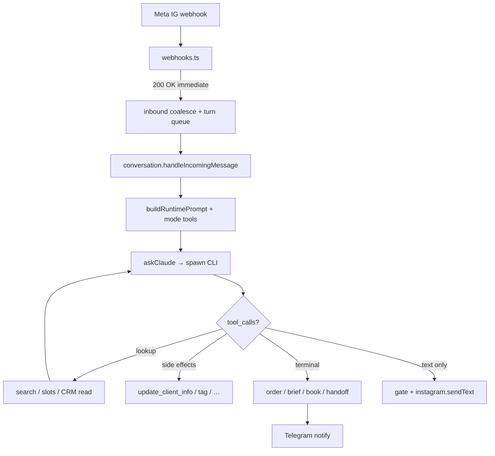

# Agent runtime — what lives inside the system

Canonical map of the Instagram DM AI agent for this platform: spawn model, prompt layers, tools, CRM, admin assistants, and performance constraints.

**Source of truth in code** (keep in sync when changing tools/CRM/modes):

| Concern | Path |
|---------|------|
| Modes + tool schemas | `apps/backend/src/lib/tool-definitions.ts` |
| Tool instructions in prompt | `apps/backend/src/lib/agent-tools-prompt.ts` |
| Platform map (modes/CRM/tools) | `apps/backend/src/lib/platform-capabilities-prompt.ts` |
| Claude CLI spawn | `apps/backend/src/services/claude.ts` |
| Customer turn orchestration | `apps/backend/src/services/conversation.ts` |
| Runtime prompt composition | `apps/backend/src/services/prompt-builder.ts`, `prompt-runtime.ts` |
| Multi-CRM routing | `apps/backend/src/lib/crm-routing.ts`, `docs/MULTI_CRM_INTEGRATION_GUIDE.md` |
| Tenant seed knowledge | `apps/workspace/templates/` |

Claude invocation = **headless Claude Code CLI** (`claude -p`), **not** the Anthropic Messages API.

---

## End-to-end customer turn

Inbound: `routes/webhooks.ts` → `lib/inbound-coalesce.ts` → `lib/conversation-turn-queue.ts` → `services/conversation.ts`.

---

## Claude CLI spawn

| Piece | Behavior |
|-------|----------|
| Binary | `~/.local/bin/claude` (`lib/claude-binary.ts`) |
| Args | `-p --output-format stream-json --verbose --model {haiku\|sonnet\|opus}` |
| CWD | `~/.cache/platform-ai-agent/{instance}/claude-spawn` — **isolated** from `~/tenant_knowledge` (avoids parent `CLAUDE.md` pollution) |
| Tools | **Text** protocol `<tool_call>{json}</tool_call>` — native CLI tools are not used in `-p` mode |
| Concurrency | `CLAUDE_MAX_CONCURRENCY` (default 2); meta-agent: `CLAUDE_META_MAX_CONCURRENCY` (default 1) |
| Session reuse | **Within a turn, same model:** follow-up tool rounds pass `resumeSessionId` → `claude -p --resume` with slim prompt; switching router↔reply model clears the session |
| Reply vs router model | Tenant picks **sonnet \| opus** for customer-facing Ukrainian replies. Tool follow-ups first try internal **Haiku** (`CLAUDE_ROUTER_MODEL`); if no further tools, reply model writes the final text. Haiku is not in the admin picker. |
| Channels | `instagram`, customer telegram, `meta_agent`, `sandbox`, `supervisor`, `insights` |

---

## Prompt composition (customer agent)

Order in `buildRuntimePrompt` / `askClaude`:

1. Anti-injection preamble  
2. Active system prompt from DB (`system_prompts`, `isActive`) with placeholders (hours, branches, brand)  
3. Session block: time, client profile, CRM history snippet, branches, Telegram bots, out-of-hours, previous brief  
4. Live catalog snippet from `~/tenant_knowledge/knowledge/{catalog,services-live,masters-live}.txt` (~12k chars)  
5. Mode tools block (`formatAgentToolsPrompt`)

| Layer | Injected at runtime? |
|-------|----------------------|
| DB system prompt | Yes |
| Seed `prompts/{sales,leadgen,booking}-agent.txt` | First DB seed only |
| Live catalog / services / masters files | Yes (snippet) |
| Legacy `knowledge/contacts|faq|…` | **No** |
| Tenant disk `CLAUDE.md` | **No** (spawn cwd isolated) |
| `<platform_capabilities>` | Meta-agent + **AI-помічник (insights)** — not the customer IG agent |

---

## Agent modes and tools

Shared: `update_client_info`, `tag_client`, `request_handoff`, `create_local_order`; optional `set_conversation_branch`.

| Mode | Purpose | Mode-specific tools | Terminal outcome |
|------|---------|---------------------|------------------|
| **sales** | E-commerce | `search_catalog`, `get_delivery_cost`, `collect_order` | Local order (+ optional CRM mirror) |
| **leadgen** | Qualification / brief | `classify_intent`, `submit_brief` | Brief + Telegram (+ optional KeyCRM lead) |
| **booking** | Salon appointment | `search_services`, `get_available_slots`, `get_client_crm_history`, `attach_reference_photo`, `book_appointment` | CRM appointment |

There are **no** cancel / reschedule / refund tools. If the client asks to cancel a visit, move a slot, or reverse a payment → `request_handoff`. Adapter `cancelBooking` exists on BeautyPro/CleverBOX but is **not** wired to the agent. A second `book_appointment` on another date creates a **new** CRM visit (BeautyPro merges only same date+location+client); it does not move the old one.

Parallel services at the same clock time need **per-line** `services[].master_id` (different professionals). A single top-level `master_id` is copied only onto lines that omit their own id; same master → sequential starts in BeautyPro. Old failed bookings: admin sets masters per Appointment service line, then retry CRM (`PATCH /orders/:id/booking-services` → `POST /orders/:id/sync-crm`).

**Telegram to managers is not a tool** — it fires as a side effect of handoff / order / brief / booking / agent failure (`services/telegram-notify.ts`).

---

## Multi-CRM

All CRM I/O goes through `getCrmAdapter` + `resolveCrmProvider(action)`. Never call CRM HTTP from `conversation.ts`.

| Provider | Typical actions |
|----------|-----------------|
| KeyCRM | catalog, orders, leads, client upsert |
| CleverBOX | services, branches, booking |
| BeautyPro | services, branches, booking, client upsert, visit history |

Routing modes: `single` | `by_action` | `prompt`. Hybrid example: catalog/order → KeyCRM, services/booking → BeautyPro.

Client link: `Client.crmBuyerId` (+ `crmProvider`, `crmLinkedAt`). Details: `docs/MULTI_CRM_INTEGRATION_GUIDE.md`, BeautyPro: `docs/BEAUTYPRO_CRM_INTEGRATION.md`.

---

## Admin assistants (three different agents)

| UI (nav) | Route | Channel | Role |
|----------|-------|---------|------|
| **AI-помічник** | `/insights` | `insights` | Read-only ops: metrics, dialogs samples, CRM/integration health, **platform capabilities** (modes/tools/CRM), config advice. No writes, no Telegram/CRM mutations. |
| **Навчання агента** | `/teach` | `meta_agent` | Edits system prompt via diffs; gets `<platform_capabilities>`. |
| **Тестування агента** | `/sandbox` | `sandbox` | Simulates customer chat with real tools/prompt. |

Insights context: fresh `buildInsightsSnapshot(period)` + `buildPlatformCapabilitiesBlock()` in `routes/insights.ts`.

---

## What the customer agent can “see”

- Active business prompt (tone, FAQ, rules, offer framing)  
- Client profile fields collected so far + tags + branch  
- Recent conversation (capped ~30 messages)  
- Catalog / services / masters live snippets + search tools  
- CRM visit history when linked (booking)  
- Working hours / out-of-hours strategy  
- Mode tool surface only (no inventing tools)

**Must not** expose to the Instagram client: product/offer/CRM UUIDs, internal ids, other conversations’ data.

---

## Performance constraints (current)

| Factor | Impact |
|--------|--------|
| Fresh CLI spawn on **first** round of a turn | Cold start cost (Opus/Sonnet) |
| Tool follow-ups | Prefer `claude -p --resume <session_id>` + slim prompt (tool result only); cold full prompt retry if resume fails |
| Semaphore max 2 | Queue / busy fallback under load |
| Large system prompt + catalog + history on cold start | Token and TTFT cost |
| Intentional `responseDelay` | Product latency (0–60s), not a bug |
| Insights snapshot | In-memory TTL (~45s) per period — chat turns reuse one snapshot |

Optimization directions (roadmap): parallelize independent tool lookups where safe; further slim cold-start session blocks.

---

## Sync checklist when changing agent surface

1. Update `tool-definitions.ts` + `agent-tools-prompt.ts`  
2. Update `platform-capabilities-prompt.ts`  
3. Update this doc + `apps/workspace/templates/CLAUDE.md` if modes/tools change  
4. Meta-agent and Insights both consume `buildPlatformCapabilitiesBlock()` — one edit covers both
