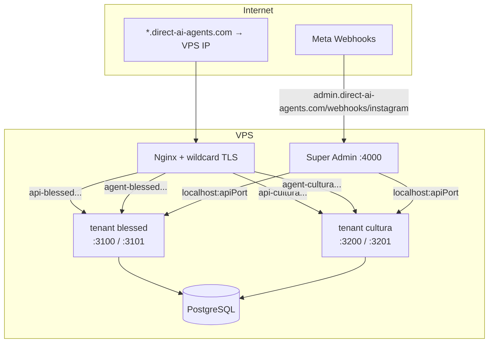
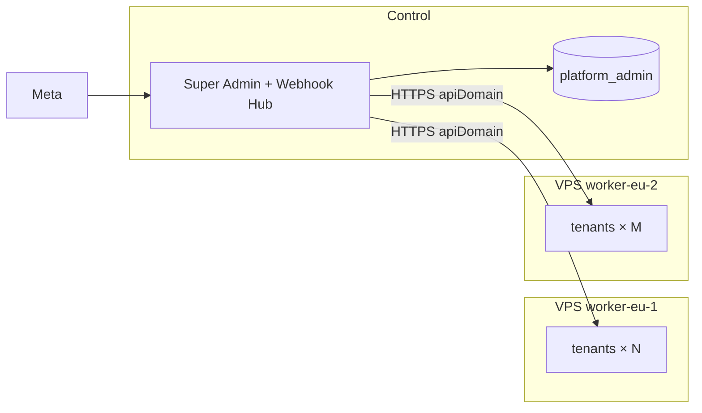

# Tenant domains & horizontal scaling

> Стандартизовані піддомени для клієнтів платформи **Direct AI Agents**  
> Формат: `api-{slug}.direct-ai-agents.com` + `agent-{slug}.direct-ai-agents.com`  
> Сумісність: існуючі клієнти з власними доменами (Status Blessed тощо) **не змінюються**.

---

## Зміст

1. [Навіщо це](#1-навіщо-це)
2. [Що залишається без змін](#2-що-залишається-без-змін)
3. [Naming convention](#3-naming-convention)
4. [Архітектура на одному сервері](#4-архітектура-на-одному-сервері)
5. [Підготовка сервера (разово)](#5-підготовка-сервера-разово)
6. [Provisioning нового клієнта](#6-provisioning-нового-клієнта)
7. [Існуючі клієнти (legacy)](#7-існуючі-клієнти-legacy)
8. [Multi-server (наступний етап)](#8-multi-server-наступний-етап)
9. [Port allocation](#9-port-allocation)
10. [Чеклист ops](#10-чеклист-ops)
11. [Довідник команд](#11-довідник-команд)

---

## 1. Навіщо це

Зараз кожен tenant — окремий Linux user з власним clone репо, PM2-процесами та PostgreSQL. Домени задаються вручну (`api.status-blessed.com`, `api.mybrand.com` …).

**Проблеми при зростанні:**

| Проблема | Platform subdomain |
|----------|-------------------|
| Certbot на кожну пару доменів | Один wildcard cert `*.direct-ai-agents.com` |
| Ручний DNS на кожного клієнта | Один wildcard A-record `*.direct-ai-agents.com` |
| Немає єдиного патерну в super-admin | Slug = instance_id = hostname |
| Складно переносити на другий VPS | Готова база для per-tenant DNS → IP worker |

**Ціль:** нові клієнти піднімаються за 1 команду з передбачуваними URL, без зміни runtime-моделі (окремий user, DB, Claude login).

---

## 2. Що залишається без змін

| Шар | Без змін |
|-----|----------|
| **Ізоляція** | 1 Linux user = 1 клієнт |
| **Runtime** | PM2 `{ID}-api`, `-bot`, `-sync`, `-admin` |
| **База** | Окремий PostgreSQL `{instance_id}_agent` |
| **Claude** | Окремий `claude auth login` per user |
| **Код** | Той самий репозиторій, різні `.env` |
| **Super-admin hub** | Один Meta webhook → routing по IG ids |
| **Legacy domains** | `provision-client.sh` з явними доменами працює як раніше |

Змінюється лише **як задаються публічні hostname** для нових клієнтів і **як nginx бере TLS** (wildcard vs per-domain).

---

## 3. Naming convention

### Slug (= `INSTANCE_ID`)

| Правило | Значення |
|---------|----------|
| Формат | `^[a-z0-9-]{2,24}$` |
| Приклади | `blessed`, `cultura`, `client-acme` |
| Linux user | = slug |
| PM2 prefix | `{SLUG^^}-` (напр. `CULTURA-api`) |
| PostgreSQL | `{slug}_agent` |

### Домени (platform mode)

```
api-{slug}.direct-ai-agents.com    → nginx → 127.0.0.1:{API_PORT}
agent-{slug}.direct-ai-agents.com  → nginx → 127.0.0.1:{ADMIN_PORT}
                                      (+ /api/ → backend)
```

**Приклад** для `cultura`:

| Змінна `.env` | Значення |
|---------------|----------|
| `INSTANCE_ID` | `cultura` |
| `API_DOMAIN` | `api-cultura.direct-ai-agents.com` |
| `ADMIN_DOMAIN` | `agent-cultura.direct-ai-agents.com` |
| `API_PORT` | `3200` |
| `ADMIN_PORT` | `3201` |

### Кастомні домени (legacy / premium)

Status Blessed може лишати `api.status-blessed.com`. Пізніше можна додати CNAME alias на platform hostname — Meta OAuth і CORS керуються через `API_DOMAIN` / `ADMIN_DOMAIN` у `.env`.

---

## 4. Архітектура на одному сервері



**Потік запиту:**

1. Клієнт відкриває `https://agent-cultura.direct-ai-agents.com`
2. Nginx (wildcard cert) проксує на `:3201` (Vue admin)
3. Admin б'є в `/api/*` → `:3200` (Fastify)
4. IG webhook (platform hub) → `localhost:3200` на цьому ж сервері

---

## 5. Підготовка сервера (разово)

Це можна зробити **зараз**, не чіпаючи існуючих клієнтів.

### 5.1 DNS (Cloudflare або інший провайдер)

На worker VPS, де живуть tenant-и:

```
Type   Name                        Value
A      *.direct-ai-agents.com      <VPS_PUBLIC_IP>
```

Control plane (landing + super-admin) — окремі записи, як зараз:

```
A      direct-ai-agents.com        <CONTROL_IP>
A      admin.direct-ai-agents.com  <CONTROL_IP>
```

> Wildcard `*.direct-ai-agents.com` покриває `api-foo` і `agent-foo` в **одному** рівні subdomain — саме тому обрано формат `api-{slug}`, а не `api.{slug}.`.

### 5.2 Wildcard TLS (DNS-01)

HTTP-01 **не** видає wildcard. Один раз на сервер:

```bash
# На VPS (root)
apt install -y python3-certbot-dns-cloudflare

mkdir -p /root/.secrets
cat > /root/.secrets/cloudflare.ini <<'EOF'
dns_cloudflare_api_token = YOUR_CLOUDFLARE_TOKEN
EOF
chmod 600 /root/.secrets/cloudflare.ini

CERTBOT_EMAIL=you@example.com \
  bash infra/scripts/setup-platform-wildcard-tls.sh
```

Cert з'явиться в `/etc/letsencrypt/live/direct-ai-agents.com/`.

**Legacy tenants** з окремими cert (`api.status-blessed.com`) продовжують використовувати свої cert paths — nginx визначає автоматично.

### 5.3 Перевірка

```bash
ls /etc/letsencrypt/live/direct-ai-agents.com/fullchain.pem
dig +short api-test.direct-ai-agents.com   # має повернути VPS IP
```

---

## 6. Provisioning нового клієнта

### Platform mode (рекомендовано)

```bash
# Явні порти
bash infra/scripts/provision-client.sh \
  cultura "Cultura Barbershop" --platform 3200 3201

# Авто-підбір наступної вільної пари портів (3100/3101, 3200/3201, …)
bash infra/scripts/provision-client.sh \
  acme "Acme Store" --platform-auto
```

Скрипт:

- створює user `cultura`, DB `cultura_agent`, clone репо
- генерує `.env` з `api-cultura.direct-ai-agents.com` / `agent-cultura.direct-ai-agents.com`
- nginx vhost з **wildcard cert** (без certbot per domain, якщо wildcard є)
- реєструє tenant у `platform_admin.tenants`

### Legacy mode (без змін)

```bash
bash infra/scripts/provision-client.sh \
  blessed Blessed \
  api.status-blessed.com agent.status-blessed.com \
  3100 3101
```

Per-domain certbot, як раніше.

### Після provision (обидва режими)

```bash
su - cultura
nano ~/platform-ai-agent-direct/.env    # Meta, Telegram, CRM, SUPERVISOR_SHARED_SECRET
claude auth login
bash ~/platform-ai-agent-direct/infra/scripts/deploy-client.sh
```

Meta OAuth redirect: `https://api-cultura.direct-ai-agents.com/api/meta/oauth/callback`

---

## 7. Існуючі клієнти (legacy)

| Клієнт | Дія |
|--------|-----|
| Status Blessed | **Нічого не міняти**, якщо custom domains працюють |
| Re-provision | `provision-client.sh` з тими ж 6 аргументами — idempotent |
| Nginx refresh | `sudo ENV_FILE=.../blessed/.env bash infra/scripts/update-nginx.sh` |

`update-nginx.sh` автоматично:

- використовує **wildcard cert**, якщо домени `api-*` / `agent-*` під `direct-ai-agents.com` і cert існує
- інакше — **per-domain cert** (legacy)

---

## 8. Multi-server (наступний етап)

Поточна архітектура вже готує ґрунт; для другого VPS потрібні **окремі зміни в коді** (не блокують platform subdomains).

### 8.1 Модель



### 8.2 Що додати (Phase 2)

| Компонент | Зміна |
|-----------|-------|
| `platform_admin.servers` | `id`, `public_ip`, `max_tenants`, `status` |
| `tenants.server_id` | який worker тримає інстанс |
| DNS | Per-tenant A: `api-{slug}` → IP **конкретного** worker (не один wildcard на всі сервери) |
| Webhook hub | Forward на `https://{tenant.apiDomain}/webhooks/instagram` замість `localhost:{port}` |
| Provision | SSH на обраний worker або ansible |

### 8.3 Ємність worker

Орієнтир для 8 vCPU / 16 GB RAM:

| Метрика | Значення |
|---------|----------|
| Комфортно | 8–12 tenants |
| `max_tenants` політика | 12, alert при 80% |
| Bottleneck | Claude CLI RAM/CPU bursts |

---

## 9. Port allocation

| Instance | API | Admin | PM2 |
|----------|-----|-------|-----|
| Super Admin | 4000 | 4001 | `SA-*` |
| Tenant 1 | 3100 | 3101 | `BLESSED-*` |
| Tenant 2 | 3200 | 3201 | `CULTURA-*` |
| Tenant N | 3100 + (N-1)×100 | +1 | `{SLUG}-*` |

`--platform-auto` шукає першу вільну пару з кроком **100**.

Whisper sidecar: `API_PORT + 5000` (як у `.env` template).

---

## 10. Чеклист ops

### Зараз (без змін runtime)

- [ ] Wildcard DNS `*.direct-ai-agents.com` → VPS
- [ ] Wildcard TLS (`setup-platform-wildcard-tls.sh`)
- [ ] Перевірити super-admin `platform_admin.tenants` для існуючих клієнтів
- [ ] Документувати slug registry (super-admin UI або таблиця)

### Новий клієнт

- [ ] Обрати slug (`^[a-z0-9-]{2,24}$`)
- [ ] `provision-client.sh … --platform-auto` або `--platform PORT PORT`
- [ ] Заповнити `.env`, `claude auth login`, `deploy-client.sh`
- [ ] Meta OAuth + webhook routing ids у super-admin
- [ ] Smoke test: admin login, sandbox chat, IG DM

### Перед другим сервером

- [ ] Таблиця `servers` + `tenant.server_id`
- [ ] Patch webhook hub → `https://apiDomain`
- [ ] Cloudflare API для per-tenant A records
- [ ] WireGuard (опційно) замість public forward

---

## 11. Довідник команд

```bash
# Wildcard TLS (разово)
CERTBOT_EMAIL=you@example.com bash infra/scripts/setup-platform-wildcard-tls.sh

# Новий клієнт — platform
bash infra/scripts/provision-client.sh myshop "My Shop" --platform-auto

# Новий клієнт — legacy custom domains
bash infra/scripts/provision-client.sh blessed Blessed \
  api.status-blessed.com agent.status-blessed.com 3100 3101

# Оновити nginx після зміни .env
sudo ENV_FILE=/home/myshop/platform-ai-agent-direct/.env \
  bash infra/scripts/update-nginx.sh

# Env overrides
PLATFORM_BASE_DOMAIN=direct-ai-agents.com \
PLATFORM_TLS_CERT_NAME=direct-ai-agents.com \
  bash infra/scripts/provision-client.sh foo "Foo" --platform 3300 3301
```

### Файли

| Файл | Призначення |
|------|-------------|
| `infra/scripts/lib/tenant-domains.sh` | Slug validation, domain builder, TLS resolver |
| `infra/scripts/provision-client.sh` | Onboarding (legacy + `--platform`) |
| `infra/scripts/update-nginx.sh` | Regenerate vhost з `.env` |
| `infra/scripts/setup-platform-wildcard-tls.sh` | DNS-01 wildcard cert |

---

*Останнє оновлення: 2026-06 — platform subdomain mode v1, backward-compatible legacy provisioning.*
